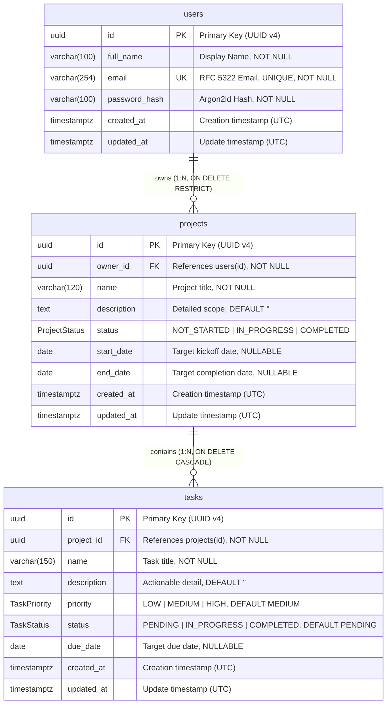

# PlanPulse — Entity-Relationship Diagram & Schema Documentation

This document describes the relational database schema, integrity constraints, indexes, and entity relationships for PlanPulse per PRD §16.

---

## 1. Entity-Relationship Diagram (ERD)



---

## 2. Enums and Data Types

### 2.1 `ProjectStatus`
| Value | Description | Hex / MD3 Badge |
|---|---|---|
| `NOT_STARTED` | Project initialized, work has not started | `#64748B` (Slate 500) |
| `IN_PROGRESS` | Work actively underway | `#D97706` (Amber 600) |
| `COMPLETED` | Project deliverables finalized | `#16A34A` (Emerald 600) |

### 2.2 `TaskStatus`
| Value | Description | Hex / MD3 Badge |
|---|---|---|
| `PENDING` | Task queued or awaiting action | `#64748B` (Slate 500) |
| `IN_PROGRESS` | Task actively being worked on | `#D97706` (Amber 600) |
| `COMPLETED` | Task requirements met and verified | `#16A34A` (Emerald 600) |

### 2.3 `TaskPriority`
| Value | Description | Hex / MD3 Badge |
|---|---|---|
| `LOW` | Minor or deferrable backlog item | `#0284C7` (Sky 600) |
| `MEDIUM` | Standard operational priority | `#D97706` (Amber 600) |
| `HIGH` | Critical path deliverable or blocker | `#DC2626` (Red 600) |

---

## 3. Table Schemas & Constraints

### 3.1 `users`
Represents application accounts and authentication identities.

| Column | Type | Nullable | Default | Description & Constraints |
|---|---|---|---|---|
| `id` | `UUID` | No | `uuid()` | Primary Key (`users_pkey`) |
| `full_name` | `VARCHAR(100)` | No | — | User's full display name. `CHECK: length(trim(full_name)) >= 1` |
| `email` | `VARCHAR(254)` | No | — | Unique login email. `UNIQUE INDEX: users_email_key` |
| `password_hash` | `VARCHAR(100)` | No | — | Secure Argon2id password hash |
| `created_at` | `TIMESTAMPTZ(6)`| No | `now()` | Timestamp of account registration |
| `updated_at` | `TIMESTAMPTZ(6)`| No | `now()` | Automatically updated timestamp |

---

### 3.2 `projects`
Represents top-level project initiatives owned by a user.

| Column | Type | Nullable | Default | Description & Constraints |
|---|---|---|---|---|
| `id` | `UUID` | No | `uuid()` | Primary Key (`projects_pkey`) |
| `owner_id` | `UUID` | No | — | Foreign Key to `users(id)` (`ON DELETE RESTRICT`) |
| `name` | `VARCHAR(120)` | No | — | Name of project. `CHECK: length(trim(name)) >= 1` |
| `description` | `TEXT` | No | `''` | Optional descriptive details |
| `status` | `ProjectStatus`| No | `'NOT_STARTED'` | Lifecycle state enum |
| `start_date` | `DATE` | Yes | `NULL` | Planned start date |
| `end_date` | `DATE` | Yes | `NULL` | Planned completion date |
| `created_at` | `TIMESTAMPTZ(6)`| No | `now()` | Project creation timestamp |
| `updated_at` | `TIMESTAMPTZ(6)`| No | `now()` | Project last modification timestamp |

#### Project Indexes & Constraints:
- **`projects_pkey`**: Primary key on `id`.
- **`projects_owner_id_created_at_idx`**: Composite B-Tree index on `(owner_id, created_at DESC)` for efficient paginated dashboard and list queries.
- **`projects_owner_id_status_idx`**: Composite B-Tree index on `(owner_id, status)` for fast status filtering and aggregation.
- **`projects_dates_check`**: `CHECK (end_date IS NULL OR start_date IS NULL OR end_date >= start_date)` guarantees temporal consistency.
- **`projects_name_check`**: `CHECK (length(trim(name)) >= 1)` prevents whitespace-only names.

---

### 3.3 `tasks`
Represents actionable units of work belonging to a specific project.

| Column | Type | Nullable | Default | Description & Constraints |
|---|---|---|---|---|
| `id` | `UUID` | No | `uuid()` | Primary Key (`tasks_pkey`) |
| `project_id` | `UUID` | No | — | Foreign Key to `projects(id)` (`ON DELETE CASCADE`) |
| `name` | `VARCHAR(150)` | No | — | Title of task. `CHECK: length(trim(name)) >= 1` |
| `description` | `TEXT` | No | `''` | Actionable details or acceptance criteria |
| `priority` | `TaskPriority` | No | `'MEDIUM'` | Urgency level enum |
| `status` | `TaskStatus` | No | `'PENDING'` | Progress lifecycle enum |
| `due_date` | `DATE` | Yes | `NULL` | Target deadline |
| `created_at` | `TIMESTAMPTZ(6)`| No | `now()` | Task creation timestamp |
| `updated_at` | `TIMESTAMPTZ(6)`| No | `now()` | Task last modification timestamp |

#### Task Indexes & Constraints:
- **`tasks_pkey`**: Primary key on `id`.
- **`tasks_project_id_created_at_idx`**: Composite B-Tree index on `(project_id, created_at DESC)` for task list ordering.
- **`tasks_project_id_status_idx`**: Composite B-Tree index on `(project_id, status)` for rapid task status filtering.
- **`tasks_project_id_priority_idx`**: Composite B-Tree index on `(project_id, priority)` for priority sorting and filtering.
- **`tasks_name_check`**: `CHECK (length(trim(name)) >= 1)` rejects blank or whitespace-only task names.

---

## 4. Referential Integrity & Cascades

1. **Project Cascade Deletion**:
   - Relationship: `tasks.project_id -> projects.id`
   - Action: `ON DELETE CASCADE ON UPDATE CASCADE`
   - When a project is deleted by its owner, all associated tasks are atomically purged within PostgreSQL, preventing orphan tasks.

2. **User Deletion Protection**:
   - Relationship: `projects.owner_id -> users.id`
   - Action: `ON DELETE RESTRICT ON UPDATE CASCADE`
   - A user account cannot be accidentally deleted while projects exist, preventing cascade disasters without explicit data retention confirmation.

3. **Multi-Tenant Ownership Enforcement**:
   - All API queries enforce tenant isolation via SQL joins:
     ```sql
     -- Task queries verify project ownership
     SELECT t.* FROM tasks t
     JOIN projects p ON t.project_id = p.id
     WHERE t.id = $1 AND p.owner_id = $2;
     ```
   - Any query attempting to access or modify resources belonging to another user returns a uniform `404 NOT_FOUND` to prevent IDOR / BOLA enumeration attacks.
